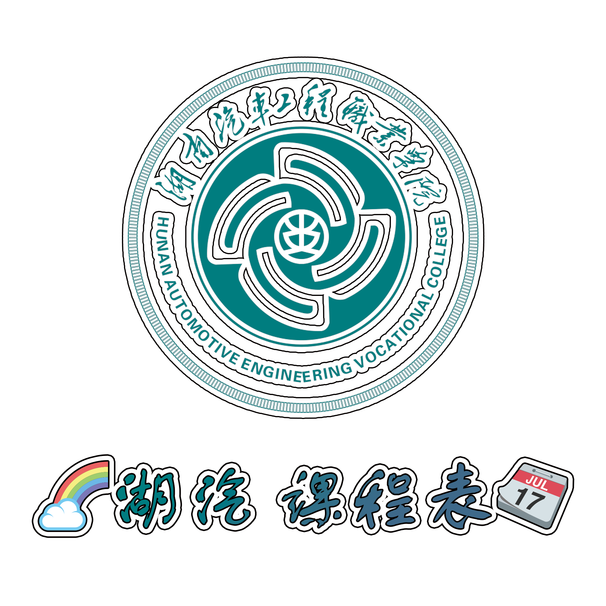

# 湖汽 课程表 项目

[]()

[English Docs(暂无)]() | [中文文档]()

## 用法

```shell
conda create -n course python=3.7
conda activate course
pip install -r requirements.txt
python api.py
```

## 项目结构

```shell
Project
├─data             # 课程表数据      
├─static           # 前端静态文件    
│  ├─css               
│  ├─images            
│  └─logo              
├─templates       # 前端模板文件
├─api.py          # 后端api （主文件）
└─utils.py        # 工具函数
```

